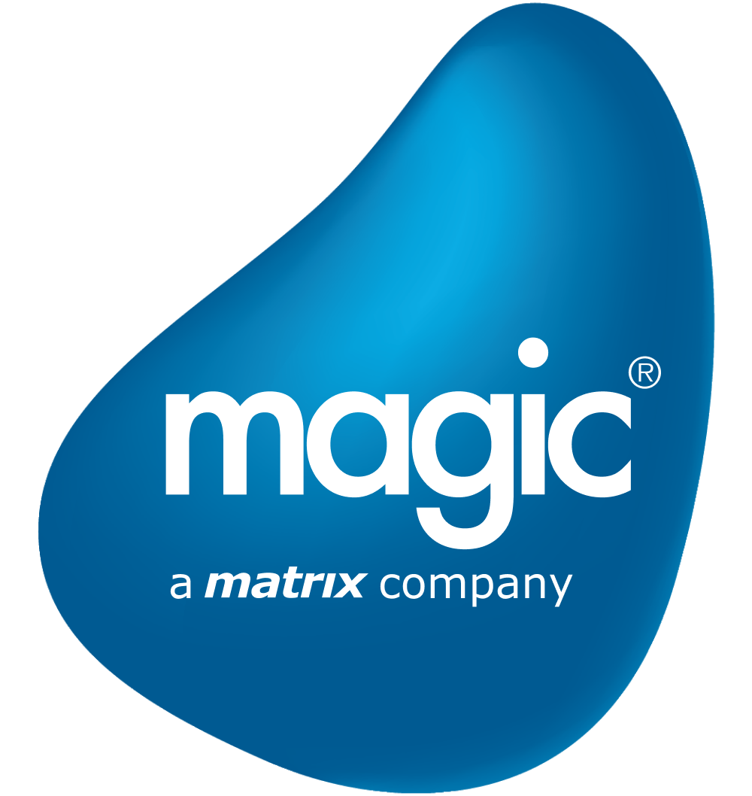

<div align="center">

# APex Offline IMM Log Analysis

A premium enterprise-grade diagnostic portal and AI-assisted Root Cause Analysis utility for **Magic XPI In-Memory Middleware (IMM)** and distributed applications.

<br>

<a href="release/APex_RCA_Setup_v1.0.exe">
  
</a>

<br><br>


<br><br>

<table>
  <tr>
    <td align="center" width="200" style="padding: 20px;">
      
    </td>
    <td align="left" style="padding: 20px;">
      <b>Created by:</b> Aniruddh Potdar (ITS-Support)<br>
      <b>Company:</b> Magic Software Enterprises Ltd. (A MATRIX Company)<br>
      <b>Copyright:</b> © 2026 Aniruddh Potdar. All rights reserved.
    </td>
  </tr>
</table>

<br>

**Troubleshooting middleware shouldn't be hard.** APex operates completely offline to merge distributed timelines, parse raw IMM diagnostics, and leverage multi-provider AI (OpenAI, Claude, Gemini, Azure) to instantly identify root causes.

</div>

<hr>

## Version History

| Version | Date | Notes | Download |
| :--- | :--- | :--- | :--- |
| **v1.0.0** | July 08, 2026 | [v1.0.0 Release Notes](docs/release_notes.md#v100-release-candidate) | [Download v1.0.0 EXE](release/APex_RCA_Setup_v1.0.exe) |

---

## ✨ Features & Capabilities

<details>
<summary><b>🧠 Auto-Learning Rules Engine</b> (Click to expand)</summary>
<br>
Automatically learns new error signatures on the fly. No need to constantly update static regex rules. The engine intelligently classifies unhandled exceptions and adds them to its dynamic diagnostic arsenal.
</details>

<details>
<summary><b>🤖 Premium AI Executive Summary</b></summary>
<br>
Built-in support for <b>OpenAI</b>, <b>Anthropic Claude</b>, <b>Google Gemini</b>, and <b>Microsoft Copilot (Azure)</b>. The AI rigorously enforces a 5-section diagnostic standard and automatically persists its markdown report (including safely rendered Mermaid architecture diagrams) to your session history.
</details>

<details>
<summary><b>⏱️ Chronological Trace Timeline & Search</b></summary>
<br>
Merges logs from completely disparate systems (e.g., Redis, Ingress, Application) into a unified, second-by-second chronological trace. Instantly filter thousands of log nodes via the client-side Search Bar to pinpoint specific timestamps, errors, or source files.
</details>

<details>
<summary><b>🎯 Actionable Remediation Plans</b></summary>
<br>
Aggregates triggered diagnostic rules into a clear, deduplicated checklist so support and engineering teams know exactly what to fix first.
</details>

<details>
<summary><b>💻 Interactive Log Viewer & History Management</b></summary>
<br>
Intelligently tracks past analysis sessions, allowing you to instantly reload or delete old forensic reports. Click on any timeline anomaly to dynamically fetch and highlight the exact failing trace within the raw log file.
</details>

---

## 🚀 Getting Started

### 1. Prerequisites
- **Python 3.10+**
- A modern web browser (Chrome, Edge, Firefox)

### 2. Setup & Execution

```bash
# Clone the repository
git clone https://github.com/aniruddhp2000/apex-offline-imm-log-analysis.git
cd apex-offline-imm-log-analysis

# Install dependencies (use a virtual environment if preferred)
pip install fastapi uvicorn pydantic python-multipart

# Start the diagnostic server
.\run.bat
```

> **Note**: Once the server starts, navigate to [http://localhost:8000](http://localhost:8000) to access the APex Hub.

---

## 🔐 Privacy & Enterprise Security

- **Air-Gapped Execution**: All static heuristics, merging, and parsing happen 100% locally on your machine.
- **Secure AI Transport**: AI Provider API keys are **never** stored on the backend server. They are encrypted and cached locally via `localStorage` in your browser and transmitted exclusively to your chosen provider's official API endpoints on-demand.

---

## 👨‍💻 Author & Attribution

- **Created by**: Aniruddh Potdar (ITS-Support)
- **Company**: Magic Software Enterprises Ltd. (A MATRIX Company)
- **Copyright**: © 2026 Aniruddh Potdar. All rights reserved.

<div align="center">
  <sub>Built with ❤️ for Magic Software Enterprises</sub>
</div>
