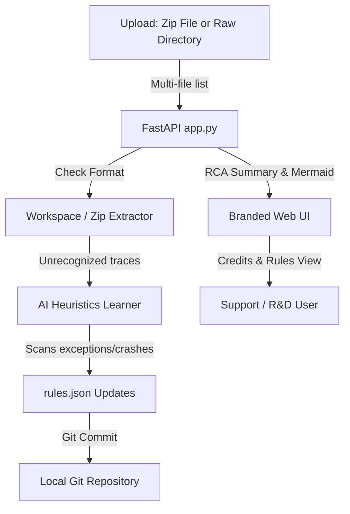

# Implementation Plan: Self-Learning Diagnostics, Folder Uploads, & Git Control

This plan details the architectural additions for self-learning diagnostics, dynamic rules updates, Git version tracking, company branding, and dual-mode directory/ZIP browse-and-drop file uploads.

---

## Technical Architecture & Flow

The system will leverage a dynamic rules database alongside Git repository control to track rule evolutions and code upgrades.



### Proposed Folder Structure Changes
We will create and modify files under `E:\Tools\imm-rca-utility`:
```
imm-rca-utility/
├── .git/                      # [NEW] Local Git version control repository
├── backend/
│   ├── config/
│   │   ├── rules.json             # Dynamic database of diagnostic rules (Learned & Static)
│   │   └── parser_config.json     # Dynamic database of regexes and timestamp formats
│   ├── analyzer/
│   │   ├── rule_learner.py        # [NEW] AI Heuristics Learner & Error Clusterer
│   │   └── rca_heuristics.py      # [MODIFY] Evaluates dynamic rules.json database
│   ├── parser/
│   │   └── generic_parser.py      # [MODIFY] Loads custom formats from parser_config.json
│   └── app.py                     # [MODIFY] Handles both ZIP and multi-file directory uploads
├── frontend/
│   ├── index.html                 # [MODIFY] Added folder upload capability, logo assets, and footer
│   ├── app.css                    # [MODIFY] Custom styling for Rules Manager & brand elements
│   └── app.js                     # [MODIFY] Dual file/directory picker controls and state
└── plans/
    ├── implementation_plan.md     # [MODIFY] Archived plan file
    └── task.md                    # [MODIFY] Updated execution tasks
```

---

## Proposed Changes

### 1. Local Git Repository Setup
* Initialize a local Git repository in `E:\Tools\imm-rca-utility` if one does not exist.
* Maintain clean commits for each implementation phase (e.g., config creations, parser modifications, learning integrations, frontend styles).

### 2. Multi-File & Directory Upload Support
* **Frontend**: Update `index.html` file input and dropzone to allow selecting:
  1. A single ZIP archive.
  2. Individual log files.
  3. A complete log directory folder (using HTML5 `webkitdirectory` and `directory` attributes).
* **Backend**: Update the `/api/upload` endpoint to receive a list of files (`files: list[UploadFile]`).
  * If a single ZIP file is uploaded, extract it recursively.
  * If a list of files (from folder upload) is uploaded, reconstruct their relative directory structures within the session's workspace folder.

### 3. Dynamic Rule Database & Learning Engine
* **`rules.json` & `parser_config.json`**: Store default heuristics (Redis/Sentinel crashes, HTTP access patterns, standard Exceptions) and custom configurations.
* **`rule_learner.py`**:
  * Scans lines of unrecognized logs for exception stack traces and log error prefixes.
  * Groups and clusters anomalies, filtering dynamic variables (e.g., memory codes, PIDs, dates).
  * Automatically creates and saves new rules into `rules.json`.
  * Triggers uvicorn restart or live reload of configurations so subsequent logs are immediately checked against the learned rule.

### 4. Company Branding & Visible Credit Attributions
* **Assets**: Load `frontend/assets/logo.png` and `frontend/assets/logo_small.png` inside header, sidebar, and dropzone zones.
* **Visible FAANG-style Footer**: Visible, professional credit signature displayed inside the sidebar footer:
  ```html
  <div class="credits-footer">
      <p class="credit-author">Engineered by <strong>Aniruddh Potdar</strong></p>
      <p class="credit-company">Magic Software Enterprises <span class="matrix-text">(A MATRIX Company)</span></p>
      <p class="credit-confidential">INTERNAL USE ONLY • CONFIDENTIAL</p>
  </div>
  ```

---

## Verification Plan

### Automated Tests
* Mock directory uploads containing new, unrecognized exceptions (e.g. `2026-06-26 12:00:00 [ActiveQueue] ERROR - ConnectionTimeoutException: Unable to connect to host`).
* Verify that the learner generates a new rule for `ConnectionTimeoutException` and updates the active JSON database.

### Manual Verification
* Test directory folder uploads using the browser directory browser dialog.
* Inspect Git history (`git log`) to verify correct tracking.
