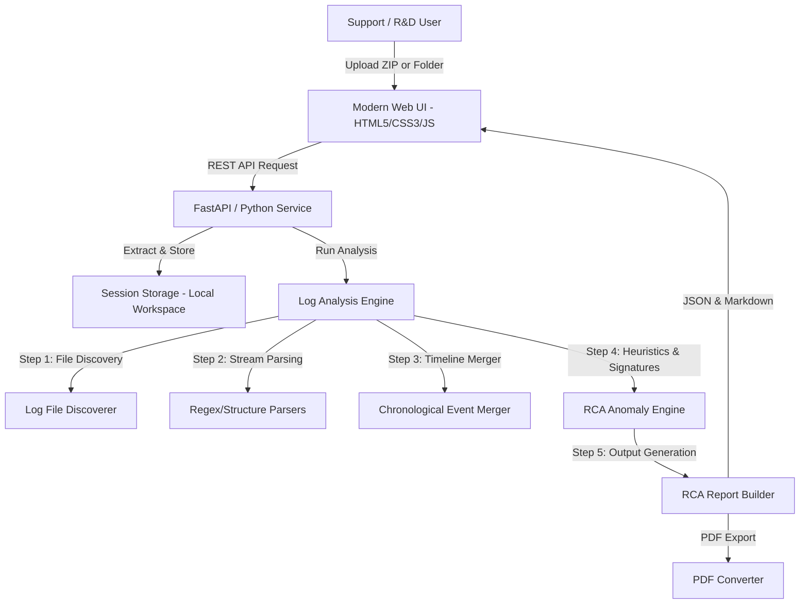

# Implementation Plan: Enterprise Log Diagnostic & Root Cause Analysis Utility

An internal, web-based utility for Support and R&D teams to upload arbitrary log archives (ZIP files or directories), automatically parse/analyze the timelines, correlate events, detect anomalies/crashes, and generate high-fidelity, interactive Root Cause Analysis (RCA) reports with download options (.md and .pdf).

---

## Architecture & System Design (FAANG Product-Grade)

The system will follow a clean, modular architecture separating the log parsing engine, analysis heuristics, report generation, and front-end visualization.



### Component Structure
The project will be structured in `C:\Users\apotdar\.gemini\antigravity-ide\scratch\log-analysis-utility`:

```
log-analysis-utility/
├── backend/
│   ├── __init__.py
│   ├── app.py                 # FastAPI Application & Routes
│   ├── config.py              # Engine limits, temp folder configurations
│   ├── parser/
│   │   ├── __init__.py
│   │   ├── file_discoverer.py # Traverses directory/ZIP to identify log types
│   │   ├── base_parser.py     # Base log parser interface
│   │   ├── redis_parser.py    # Parsers for Redis / Sentinel logs
│   │   ├── generic_parser.py  # Syslog, Web Server (Nginx/APACHE/ALB), Log4j parser
│   │   └── json_parser.py     # JSON/structured application logs
│   ├── analyzer/
│   │   ├── __init__.py
│   │   ├── timeline_merger.py # Merges logs from different streams chronologically
│   │   └── rca_heuristics.py  # Detects crashes, timeouts, exceptions, SIGSEGV, restarts
│   └── utils/
│       ├── __init__.py
│       ├── pdf_exporter.py    # Converts Markdown to high-quality PDF reports
│       └── workspace.py       # Manages temporary uploads and extractions safely
├── frontend/
│   ├── index.html             # Single-page UI structure
│   ├── app.css                # Premium Glassmorphic / Dark mode styling
│   └── app.js                 # Frontend state, file upload handlers, rendering
├── docs/
│   ├── whitepaper_architecture.md # Technical Architecture White Paper
│   └── user_guide.md          # User manual for Support & R&D teams
├── plans/
│   ├── phase1_backend_parsing.md
│   └── phase2_frontend_ui.md
├── requirements.txt           # Python dependencies
└── run.bat                    # Local dev server execution script
```

---

## User Review Required

> [!IMPORTANT]
> **Active Workspace Recommendation**: We recommend setting the active workspace to `C:\Users\apotdar\.gemini\antigravity-ide\scratch\log-analysis-utility` once execution begins, allowing easy navigation and editing.

> [!NOTE]
> **Analysis Engine Extensibility**: The parsing engine is designed to be highly modular. Support teams will be able to add custom regular expressions to `backend/parser/generic_parser.py` for new application log formats without restructuring the codebase.

---

## Proposed Changes

### Backend Implementation

#### [NEW] [app.py](file:///C:/Users/apotdar/.gemini/antigravity-ide/scratch/log-analysis-utility/backend/app.py)
* Initialize FastAPI server.
* Endpoints:
  * `POST /api/upload`: Receives ZIP file or directory upload, creates a session workspace, extracts files.
  * `GET /api/analyze/{session_id}`: Triggers the multi-step log parsing and anomaly analysis. Returns report data.
  * `GET /api/download/markdown/{session_id}`: Downloads the generated RCA report in Markdown.
  * `GET /api/download/pdf/{session_id}`: Generates and downloads the PDF version of the report.

#### [NEW] [file_discoverer.py](file:///C:/Users/apotdar/.gemini/antigravity-ide/scratch/log-analysis-utility/backend/parser/file_discoverer.py)
* Scans files recursively.
* Identifies text-based files, skips binary blobs (images, etc.).
* Classifies logs into categories: Redis, Sentinel, Kubernetes, Web Server Access/Error Logs, General Application Logs.

#### [NEW] [timeline_merger.py](file:///C:/Users/apotdar/.gemini/antigravity-ide/scratch/log-analysis-utility/backend/analyzer/timeline_merger.py)
* Parses timestamps using flexible datetime parsing (UTC and JST conversions).
* Combines logs from multiple files in a unified timeline.
* Implements sliding window anomaly matching.

#### [NEW] [rca_heuristics.py](file:///C:/Users/apotdar/.gemini/antigravity-ide/scratch/log-analysis-utility/backend/analyzer/rca_heuristics.py)
* Scans the timeline for critical signatures:
  * Redis/Sentinel crashes: `crashed by signal`, `Segmentation fault`, `+sdown`, `+odown`.
  * HTTP status errors: ` 500 `, ` 503 `, ` 502 `.
  * Application stack traces: `NullPointerException`, `Traceback (most recent call)`, `OutOfMemoryError`.
* Auto-correlates errors across different services (e.g. database crash corresponding to load balancer HTTP 500 spikes).

#### [NEW] [pdf_exporter.py](file:///C:/Users/apotdar/.gemini/antigravity-ide/scratch/log-analysis-utility/backend/utils/pdf_exporter.py)
* Generates a cleanly formatted PDF document from the markdown report using `weasyprint` or a lightweight python parser.

### Frontend Implementation

#### [NEW] [index.html](file:///C:/Users/apotdar/.gemini/antigravity-ide/scratch/log-analysis-utility/frontend/index.html)
* Provides a drop zone for ZIP files or directories.
* Displays analysis progress via active status step animations.
* Implements a responsive dual-panel layout:
  * **Left Panel**: Interactive timeline highlighting anomalies and log correlations.
  * **Right Panel**: Full Markdown RCA report with search, expand/collapse, and download controls.

#### [NEW] [app.css](file:///C:/Users/apotdar/.gemini/antigravity-ide/scratch/log-analysis-utility/frontend/app.css)
* Sleek dark mode / glassmorphism theme using CSS Custom Properties (variables).
* Modern font styling (Google Fonts Inter/Outfit) with elegant slide transitions and glowing progress indicators.

#### [NEW] [app.js](file:///C:/Users/apotdar/.gemini/antigravity-ide/scratch/log-analysis-utility/frontend/app.js)
* Manages state, AJAX uploads, and handles progress polling.
* Implements interactive timeline zoom and filter functions.
* Integrates Mermaid.js rendering for dynamic sequence diagrams generated during analysis.

### Documentation & Management

#### [NEW] [whitepaper_architecture.md](file:///C:/Users/apotdar/.gemini/antigravity-ide/scratch/log-analysis-utility/docs/whitepaper_architecture.md)
* Standard FAANG-grade white paper detailing:
  * High-Availability cluster failover tracking mechanics.
  * Dynamic regex heuristics for unknown log signatures.
  * Timeline alignment algorithms across disparate timezones (UTC/JST).
  * Design patterns (Strategy pattern for log parsing, Observer pattern for progress reporting).

---

## Verification Plan

### Automated Tests
* Unit tests for log format parsers (Redis, generic stack trace, and HTTP servers).
* Unit tests for chronological timeline merging.
* Mock upload integration tests.

### Manual Verification
* Uploading the NHK incident ZIP logs (`K8sPodLogs_2026-06-26_10-05-14.zip` and `ALBのログ.zip`) to verify the utility accurately identifies the Redis crash trace, links the 10-minute crash cycle of `imm-db-0`/`imm-db-1`, and highlights the load balancer HTTP 500 correlation.
* Verifying responsive design on Chrome, Edge, and Firefox.
* Validating PDF and Markdown download exports.
